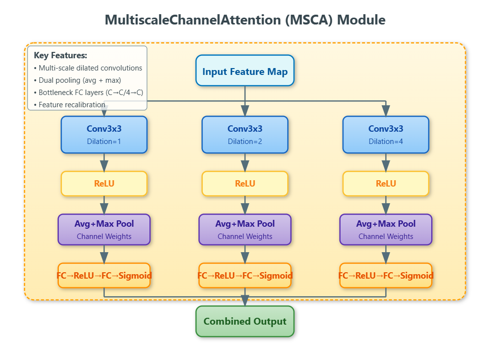

# MultiScaleHazeTransformer (MSHTransformer)

A novel deep learning framework for efficient and accurate single-image dehazing that combines multiscale attention mechanisms with transformer-based representations.

## 🔍 Overview

The MultiScaleHazeTransformer addresses the challenges of haze removal in diverse scenarios by leveraging:
- **Multiscale attention mechanisms** to capture spatial information across multiple receptive fields
- **Transformer-based global context modeling** to enhance feature interactions with reduced computational overhead
- **Hierarchical residual structure** for robust feature extraction and haze removal

This architecture effectively handles varying haze densities and scales while maintaining computational efficiency for real-time applications.

## 🏛️ Architecture

The MultiScaleHazeTransformer consists of five main components working in harmony:

### 1. Pre-processing Module
- Initial feature extraction from RGB input (3→32 channels)
- 3×3 convolution with ReLU activation
- Provides robust foundation for subsequent operations

### 2. Grouped Residual Blocks
- Two sequential groups of residual blocks
- Each block contains multiscale convolutions and attention mechanisms
- Residual connections for gradient stability and feature reusability

### 3. MultiScale Channel Attention (MSCA)
- Applies convolutional filters of varying sizes (3×3, 5×5, 7×7)
- Captures haze patterns at different scales
- Softmax-based attention maps for feature emphasis

### 4. Transformer Block
- Multi-head attention for long-range dependency modeling
- Layer normalization and feed-forward networks
- Adaptive pooling and interpolation for memory efficiency

### 5. Post-processing Module
- Feature dimensionality reduction
- RGB image reconstruction
- Skip connections for detail preservation


*Complete MultiScaleHazeTransformer Architecture*

 
*MultiScale Channel Attention Module*


*Transformer Block with Adaptive Pooling*


## 🚀 Quick Start in Google Colab

### Step 1: Clone Repository and Install Dependencies

```bash
# Clone the repository
!git clone https://github.com/hiprashantsaini/MSHTransformer.git

# Install required packages
!pip install numpy==1.23.1 Pillow==9.2.0 tensorboardX==2.5.1 tqdm==4.64.0
!pip install gdown
```

### Step 2: Mount Google Drive and Setup Directories

```python
from google.colab import drive
drive.mount('/content/drive')
```

```bash
# Create necessary directories
!mkdir -p /content/MSHTransformer/trained_models
!mkdir -p /content/MSHTransformer/data/ITS_TEST/indoor/hazy
!mkdir -p /content/MSHTransformer/data/ITS_TEST/indoor/clear
!mkdir -p /content/MSHTransformer/data/OTS_TEST/outdoor/hazy
!mkdir -p /content/MSHTransformer/data/OTS_TEST/outdoor/clear
!mkdir -p /content/MSHTransformer/data/ITS
```

### Step 3: Prepare Dataset

#### For Testing (120 test images)
```bash
# Copy test images from Google Drive
!cp /content/drive/MyDrive/ITS_TEST/clear/* /content/MSHTransformer/data/ITS_TEST/indoor/clear/
!cp /content/drive/MyDrive/ITS_TEST/hazy/* /content/MSHTransformer/data/ITS_TEST/indoor/hazy/
```

#### For Training
```bash
# Copy training dataset (clear images)
!cp -r "/content/drive/MyDrive/clear_data_set"/* /content/MSHTransformer/data/ITS/
```

### Step 4: Navigate to Project Directory

```bash
%cd /content/MSHTransformer
```

## 🎯 Usage

### Training the Model

Train the MultiScaleHazeTransformer with the following parameters:

```bash
!python main.py \
    --crop \
    --crop_size=128 \
    --blocks=10 \
    --gps=2 \
    --bs=2 \
    --lr=0.0001 \
    --trainset='its_train' \
    --testset='its_test' \
    --steps=200 \
    --eval_step=100 \
    --clcrloss \
    --clip
```

#### Training Parameters:
- `--crop`: Enable random cropping for data augmentation
- `--crop_size=128`: Input patch size for training
- `--blocks=10`: Number of residual blocks in each group
- `--gps=2`: Number of grouped residual blocks
- `--bs=2`: Batch size (adjust based on GPU memory)
- `--lr=0.0001`: Learning rate
- `--trainset='its_train'`: Training dataset identifier
- `--testset='its_test'`: Testing dataset identifier
- `--steps=200`: Total training steps
- `--eval_step=100`: Evaluation frequency
- `--clcrloss`: Enable clear-color loss
- `--clip`: Enable gradient clipping

### Testing/Inference

Perform dehazing on test images:

```bash
!python dehaze.py -d indoor
```

#### Testing Options:
- `-d indoor`: Test on indoor scenes (ITS dataset)
- `-d outdoor`: Test on outdoor scenes (OTS dataset)

## 📁 Dataset Structure

Ensure your data is organized as follows:

```
MSHTransformer/
├── data/
│   ├── ITS/                    # Training data
│   │   └── clear/              # Clear reference images
│   ├── ITS_TEST/              # Testing data
│   │   └── indoor/
│   │       ├── hazy/          # Hazy input images
│   │       └── clear/         # Ground truth clear images
│   └── OTS_TEST/              # Outdoor testing data
│       └── outdoor/
│           ├── hazy/
│           └── clear/
├── trained_models/            # Saved model checkpoints
├── main.py                    # Training script
├── dehaze.py                 # Inference script
└── README.md
```

## 🔧 Key Features

### MultiScale Attention Mechanism
- Captures haze patterns at multiple scales simultaneously
- Adaptive feature weighting through learnable attention maps
- Robust handling of non-uniform haze distributions

### Transformer Integration
- Global context modeling for spatially varying haze patterns
- Memory-efficient design with adaptive resolution scaling
- Enhanced feature interactions across distant image regions

### Computational Efficiency
- Adaptive pooling reduces memory requirements
- Residual connections prevent vanishing gradients
- Optimized for real-time applications


## 🛠️ Troubleshooting


### Performance Tips:
- Use GPU runtime for faster training and inference
- Ensure sufficient RAM allocation in Colab
- Monitor training progress through tensorboard logs


## 📄 License

This project is licensed under the MIT License - see the LICENSE file for details.

## 🙏 Acknowledgments

- RESIDE dataset creators for comprehensive benchmarking resources
- Open-source community for invaluable deep learning tools and frameworks
- Academic mentors and peers for continuous support and feedback

---

**Note**: Make sure to update the image paths in the architecture section with actual paths to your architecture diagrams once they are uploaded to your repository.